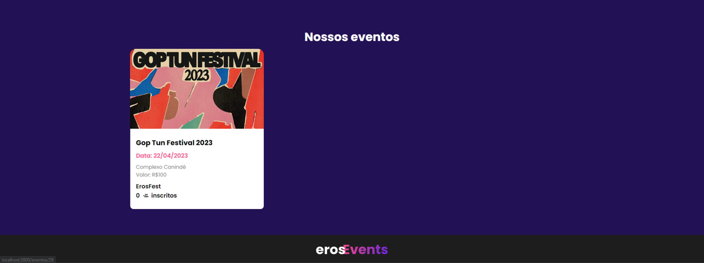
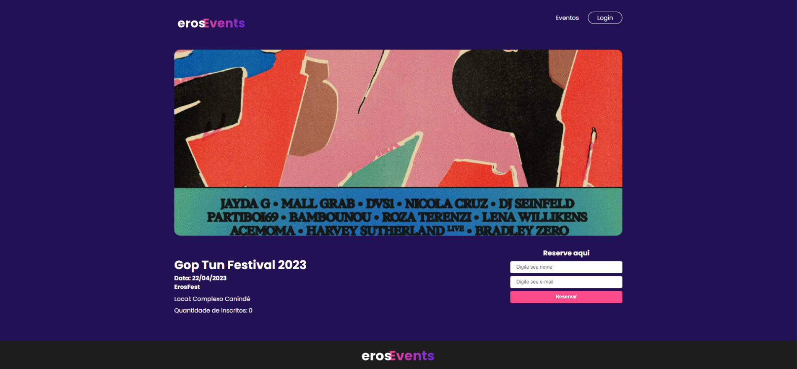
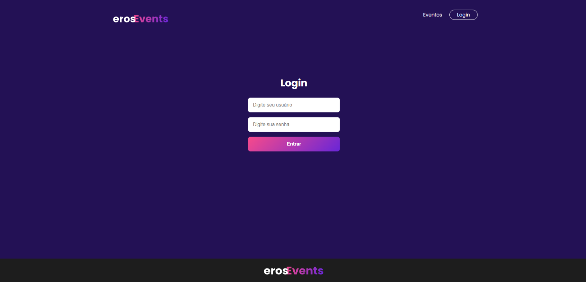
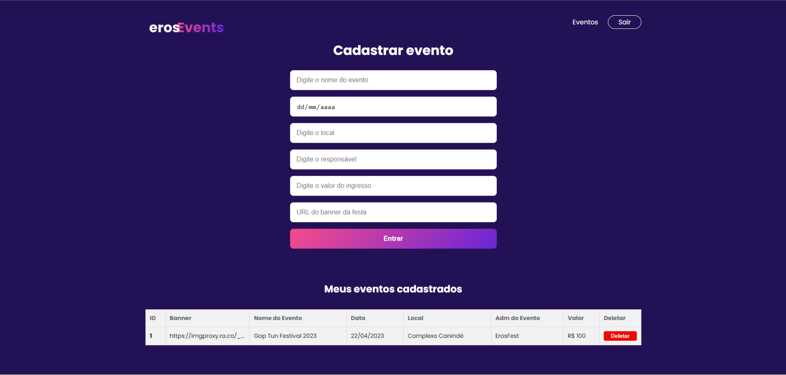

<h1 align="center">

</h1>

<h4 align="center"> 🚀ErosEvent - Aplicação de gerenciamento de Festas 🚀 </h4>

##  💻 Sobre o projeto

  
🔧 Projeto voltado para o gerenciamento de festas tendo as seguintes funções

- Exibir Festa para os usuários do site
- Formulário de cadastro para o usuário ir para a festa
- Sistema de administração 
- Cadastro de Festa
- Permissão para editar e cancelar festa

- Observação: Editar e formulário de cadastros estão em aberto, a rota de edição já está feita, basta chamar a API com as informações e o formulário de cadastro, já está funcionando as pessoas cadastradas na festa, agora seria interessante enviar para o email do usuário um QR e as informações para a festa

  

##  🎨 Layout

##  🛠 Tecnologias
  

As seguintes ferramentas foram usadas na construção do projeto:

  

- NextJs

- Styled-Components

- MySql

- NodeJs

  
##  🚀 Como executar o projeto

  

O primeiro passo é fazer o download do repositório para a sua máquina

 
- rodar: npm install

Criar um banco de dados MYSQL com a seguinte tabela:

 
Nome da tabela: eventos 
colunas: id(autoincrement), banner, nome_evento, data, local, admin_evento, quantidade_inscritos, valor

 

Criar um arquivo .env na raiz do seu projeto com os seguintes requisitos: 

- MYSQL_HOST=sua-chave
- MYSQL_DATABASE=sua-chave
- MYSQL_USER=sua-chave
- MYSQL_PASSWORD=sua-chave
- MYSQL_DATABASE_URL=sua-chave
- MYSQL_PORT=sua-chave
- NEXT_PUBLIC_URL=http://localhost:3000/ (sua-chave)

- rodar: npm run dev
